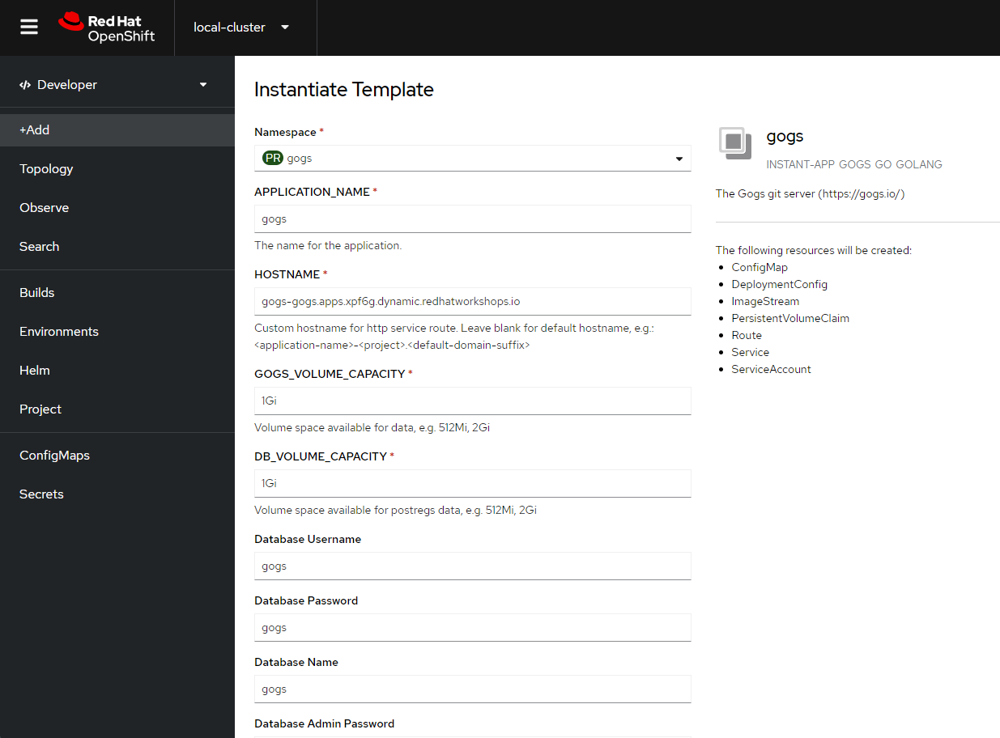

## Gogs

### 1. 이미지 준비

- 인터넷이 되지 않는 환경에서는 다음 이미지가 필요하며, 해당 이미지를 OpenShift 환경에 ImageStream으로 Import 합니다.

  - 이미지 리스트

    ```bash
    skopeo copy --dest-creds ${USER}:${PASSWORD} --dest-tls-verify=false docker://docker.io/openshiftdemos/gogs:latest docker://${REGISTRY_HOST}:${PORT}/gogs:latest
    skopeo copy --src-creds ${USER}:${PASSWORD} --dest-creds ${USER}:${PASSWORD} --dest-tls-verify=false docker://registry.redhat.io/rhel8/postgresql-12:1-170 docker://${REGISTRY_HOST}:${PORT}/postgresql-12:1-170
    ```

  - 이미지 임포트

    ```bash
    oc import-image rhel8/postgresql-12:latest --from=registry.redhat.io/rhel8/postgresql-12:1-170 --confirm --insecure -n openshift
    oc import-image gogs/gogs:latest --from=docker.io/gogs/gogs:latest --confirm --insecure -n openshift
    oc import-image gogs/gogs:latest --from=docker.io/gogs/gogs:latest --confirm --insecure -n gogs
    ```

    >  내부 레지스트리로 옮긴 후에 임포트 하는 경우에는 위의 from 절의 주소를 내부 레지스트리 주소로 치환하여 실행합니다.

### 2. 프로젝트 및 템플릿 생성

- 프로젝트 생성

  ```bash
  oc new-project gogs
  ```

- template.yaml

  ```yaml
  kind: Template
  apiVersion: template.openshift.io/v1
  metadata:
    annotations:
      description: The Gogs git server (https://gogs.io/)
      tags: instant-app,gogs,go,golang
    name: gogs
  objects:
  - apiVersion: v1
    kind: Secret
    metadata:
      annotations:
        template.openshift.io/expose-database_name: '{.data[''database-name'']}'
        template.openshift.io/expose-password: '{.data[''database-password'']}'
        template.openshift.io/expose-username: '{.data[''database-user'']}'
      name: '${APPLICATION_NAME}-postgresql'
    stringData:
      database-name: '${DATABASE_NAME}'
      database-password: '${DATABASE_PASSWORD}'
      database-user: '${DATABASE_USER}'
  - apiVersion: v1
    kind: Service
    metadata:
      annotations:
        template.openshift.io/expose-uri: >-
          postgres://{.spec.clusterIP}:{.spec.ports[?(.name=="postgresql")].port}
      name: '${APPLICATION_NAME}-postgresql'
    spec:
      ports:
        - name: postgresql
          nodePort: 0
          port: 5432
          protocol: TCP
          targetPort: 5432
      selector:
        name: '${APPLICATION_NAME}-postgresql'
      sessionAffinity: None
      type: ClusterIP
    status:
      loadBalancer: {}
  - apiVersion: v1
    kind: PersistentVolumeClaim
    metadata:
      name: '${APPLICATION_NAME}-postgresql'
    spec:
      accessModes:
        - ReadWriteOnce
      resources:
        requests:
          storage: '${DB_VOLUME_CAPACITY}'
  - apiVersion: v1
    kind: DeploymentConfig
    metadata:
      annotations:
        template.alpha.openshift.io/wait-for-ready: 'true'
      name: '${APPLICATION_NAME}-postgresql'
      labels:
        app: ${APPLICATION_NAME}
        app.kubernetes.io/component: database
        app.kubernetes.io/instance: ${APPLICATION_NAME}
        app.kubernetes.io/name: ${APPLICATION_NAME}-postgresql
        app.kubernetes.io/part-of: ${APPLICATION_NAME}
    spec:
      replicas: 1
      selector:
        name: '${APPLICATION_NAME}-postgresql'
      strategy:
        type: Recreate
      template:
        metadata:
          labels:
            name: '${APPLICATION_NAME}-postgresql'
        spec:
          containers:
            - resources:
                limits:
                  memory: '256Mi'
              readinessProbe:
                exec:
                  command:
                    - /usr/libexec/check-container
                initialDelaySeconds: 5
                timeoutSeconds: 1
              terminationMessagePath: /dev/termination-log
              name: postgresql
              livenessProbe:
                exec:
                  command:
                    - /usr/libexec/check-container
                    - '--live'
                initialDelaySeconds: 120
                timeoutSeconds: 10
              env:
                - name: POSTGRESQL_USER
                  valueFrom:
                    secretKeyRef:
                      key: database-user
                      name: '${APPLICATION_NAME}-postgresql'
                - name: POSTGRESQL_PASSWORD
                  valueFrom:
                    secretKeyRef:
                      key: database-password
                      name: '${APPLICATION_NAME}-postgresql'
                - name: POSTGRESQL_DATABASE
                  valueFrom:
                    secretKeyRef:
                      key: database-name
                      name: '${APPLICATION_NAME}-postgresql'
              securityContext:
                capabilities: {}
                privileged: false
              ports:
                - containerPort: 5432
                  protocol: TCP
              imagePullPolicy: IfNotPresent
              volumeMounts:
                - mountPath: /var/lib/pgsql/data
                  name: '${APPLICATION_NAME}-postgresql-data'
              capabilities: {}
              image: ' '
          dnsPolicy: ClusterFirst
          restartPolicy: Always
          volumes:
            - name: '${APPLICATION_NAME}-postgresql-data'
              persistentVolumeClaim:
                claimName: '${APPLICATION_NAME}-postgresql'
      triggers:
        - imageChangeParams:
            automatic: true
            containerNames:
              - postgresql
            from:
              kind: ImageStreamTag
              name: 'postgresql-12:${DATABASE_VERSION}'
              namespace: 'openshift'
            lastTriggeredImage: ''
          type: ImageChange
        - type: ConfigChange
  - kind: ServiceAccount
    apiVersion: v1
    metadata:
      labels:
        app: ${APPLICATION_NAME}
      name: ${APPLICATION_NAME}
  - kind: Service
    apiVersion: v1
    metadata:
      labels:
        app: ${APPLICATION_NAME}
      name: ${APPLICATION_NAME}
    spec:
      ports:
      - name: 3000-tcp
        port: 3000
        protocol: TCP
        targetPort: 3000
      selector:
        app: ${APPLICATION_NAME}
        deploymentconfig: ${APPLICATION_NAME}
      sessionAffinity: None
      type: ClusterIP
  - kind: Route
    apiVersion: v1
    id: ${APPLICATION_NAME}-http
    metadata:
      labels:
        app: ${APPLICATION_NAME}
      name: ${APPLICATION_NAME}
    spec:
      host: ${HOSTNAME}
      to:
        name: ${APPLICATION_NAME}
  - kind: DeploymentConfig
    apiVersion: v1
    metadata:
      labels:
        app: ${APPLICATION_NAME}
        app.kubernetes.io/component: gogs
        app.kubernetes.io/instance: ${APPLICATION_NAME}
        app.kubernetes.io/name: gogs
        app.kubernetes.io/part-of: ${APPLICATION_NAME}
      name: ${APPLICATION_NAME}
    spec:
      replicas: 1
      selector:
        app: ${APPLICATION_NAME}
        deploymentconfig: ${APPLICATION_NAME}
      strategy:
        resources: {}
        rollingParams:
          intervalSeconds: 1
          maxSurge: 25%
          maxUnavailable: 25%
          timeoutSeconds: 600
          updatePeriodSeconds: 1
        type: Rolling
      template:
        metadata:
          creationTimestamp: null
          labels:
            app: ${APPLICATION_NAME}
            deploymentconfig: ${APPLICATION_NAME}
        spec:
          serviceAccountName: ${APPLICATION_NAME}
          containers:
          - image: " "
            imagePullPolicy: Always
            name: ${APPLICATION_NAME}
            ports:
            - containerPort: 3000
              protocol: TCP
            resources: {}
            terminationMessagePath: /dev/termination-log
            volumeMounts:
            - name: gogs-data
              mountPath: /opt/gogs/data
            - name: gogs-config
              mountPath: /etc/gogs/conf
            readinessProbe:
                httpGet:
                  path: /
                  port: 3000
                  scheme: HTTP
                initialDelaySeconds: 40
                timeoutSeconds: 1
                periodSeconds: 20
                successThreshold: 1
                failureThreshold: 10
            livenessProbe:
                httpGet:
                  path: /
                  port: 3000
                  scheme: HTTP
                initialDelaySeconds: 40
                timeoutSeconds: 1
                periodSeconds: 10
                successThreshold: 1
                failureThreshold: 10
          dnsPolicy: ClusterFirst
          restartPolicy: Always
          securityContext: {}
          terminationGracePeriodSeconds: 30
          volumes:
          - name: gogs-data
            persistentVolumeClaim:
              claimName: ${APPLICATION_NAME}-data
          - name: gogs-config
            configMap:
              name: ${APPLICATION_NAME}-config
              items:
                - key: app.ini
                  path: app.ini
      test: false
      triggers:
      - type: ConfigChange
      - imageChangeParams:
          automatic: true
          containerNames:
          - ${APPLICATION_NAME}
          from:
            kind: ImageStreamTag
            name: ${APPLICATION_NAME}:${GOGS_VERSION}
        type: ImageChange
  - kind: ImageStream
    apiVersion: v1
    metadata:
      labels:
        app: ${APPLICATION_NAME}
      name: ${APPLICATION_NAME}
    spec:
      tags:
      - name: "${GOGS_VERSION}"
        from:
          kind: DockerImage
          name: quay.io/siamaksade/gogs:${GOGS_VERSION}
        importPolicy: {}
        annotations:
          tags: gogs,go,golang
          version: "${GOGS_VERSION}"
  - kind: PersistentVolumeClaim
    apiVersion: v1
    metadata:
      name: ${APPLICATION_NAME}-data
      labels:
        app: ${APPLICATION_NAME}
    spec:
      accessModes:
        - ReadWriteOnce
      resources:
        requests:
          storage: ${GOGS_VOLUME_CAPACITY}
  - kind: ConfigMap
    apiVersion: v1
    metadata:
      name: ${APPLICATION_NAME}-config
      labels:
        app: ${APPLICATION_NAME}
    data:
      app.ini: |
        RUN_MODE = prod
        RUN_USER = gogs
  
        [database]
        DB_TYPE  = postgres
        HOST     = ${APPLICATION_NAME}-postgresql:5432
        NAME     = ${DATABASE_NAME}
        USER     = ${DATABASE_USER}
        PASSWD   = ${DATABASE_PASSWORD}
  
        [repository]
        ROOT = /opt/gogs/data/repositories
  
        [server]
        ROOT_URL=http://${HOSTNAME}
        SSH_DOMAIN=${HOSTNAME}
  
        [security]
        INSTALL_LOCK = ${INSTALL_LOCK}
  
        [service]
        ENABLE_CAPTCHA = false
  
        [webhook]
        SKIP_TLS_VERIFY = ${SKIP_TLS_VERIFY}
  parameters:
  - description: The name for the application.
    name: APPLICATION_NAME
    required: true
    value: gogs
  - description: 'Custom hostname for http service route.  Leave blank for default hostname, e.g.: <application-name>-<project>.<default-domain-suffix>'
    name: HOSTNAME
    required: true
  - description: Volume space available for data, e.g. 512Mi, 2Gi
    name: GOGS_VOLUME_CAPACITY
    required: true
    value: 1Gi
  - description: Volume space available for postregs data, e.g. 512Mi, 2Gi
    name: DB_VOLUME_CAPACITY
    required: true
    value: 1Gi
  - displayName: Database Username
    from: gogs
    value: gogs
    name: DATABASE_USER
  - displayName: Database Password
    from: '[a-zA-Z0-9]{8}'
    value: gogs
    name: DATABASE_PASSWORD
  - displayName: Database Name
    name: DATABASE_NAME
    value: gogs
  - displayName: Database version (PostgreSQL)
    name: DATABASE_VERSION
    value: "latest"
  - name: GOGS_VERSION
    displayName: Gogs Version
    description: 'Version of the Gogs container image to be used (check the available version https://hub.docker.com/r/openshiftdemos/gogs/tags)'
    value: "stable"
    required: true
  - name: INSTALL_LOCK
    displayName: Installation lock
    description: 'If set to true, installation (/install) page will be disabled. Set to false if you want to run the installation wizard via web'
    value: "true"
  - name: SKIP_TLS_VERIFY
    displayName: Skip TLS verification on webhooks
    description: Skip TLS verification on webhooks. Enable with caution!
    value: "false"
  ```

- 템플릿 배포

  ```bash
  oc apply -f gogs.yaml -n openshift
  ```

### 4. Gogs 배포

- 배포 전에 호스트 이름 확인 하기

- gogs-gogs.apps.$BASE_DOMAIN

  


